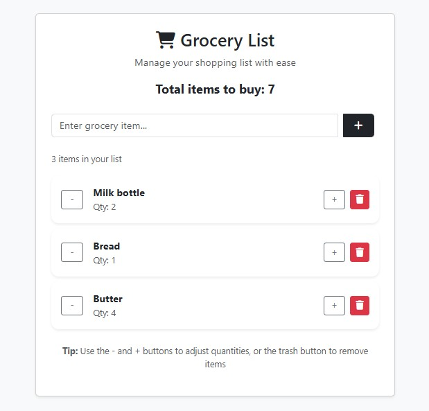

# 🛒 Grocery List App

A simple, responsive web application to manage your grocery shopping list with ease. Built using **HTML**, **Bootstrap 5**, **Font Awesome**, and **vanilla JavaScript**, this app lets users add items, adjust quantities, and remove entries—all in a clean, intuitive UI.

## ✨ Demo

You can preview the app by opening `GroceryListApp.html` directly in your browser. Here's a quick look at the UI:

## 📸 Screenshot



---

## 🚀 Features

- ✅ Add grocery items dynamically
- ➕➖ Adjust item quantities with plus/minus buttons
- 🗑️ Remove items instantly
- 📊 Real-time summary of total items and unique entries
- 🎨 Responsive design using Bootstrap 5
- 🧠 No external dependencies beyond CDN links

---

## 📦 Tech Stack

| Technology   | Purpose                       |
| ------------ | ----------------------------- |
| HTML5        | Markup structure              |
| Bootstrap 5  | Styling and layout            |
| Font Awesome | Icons for buttons and UI cues |
| JavaScript   | DOM manipulation and logic    |

---

## 🧰 Setup Instructions

1. **Clone the repository**
   ```bash
   git clone https://github.com/your-username/grocery-list-app.git
   ```
